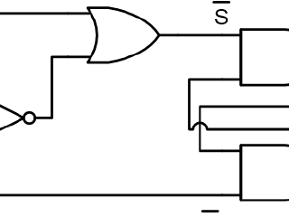

**🔗 [View on GitHub](https://github.com/sven-axm/glfw-wrapper)**

A convenience wrapper for creating and managing Glfw windows.

## Motivation

Setting up a Vulkan renderer, even in its most simple form, requires a lot of boilerplate code. One part is also the creation of a window.
Glfw already abstracts away the platform-specifics of this problem and it is not necessary anymore to do all the heavy lifting with the WinApi. But after starting a new project which uses Glfw, you usually find yourself writing the same code all over again and having to look up some part of the API documentation. This small wrapper library provides some more convenience functionality
for creating and managing the window so that it just works with one line of code if you can live with a window which is set up with default properties. It is written as a thin OOP layer in C++ and all important functionality is readily accessible via the window class instance.
